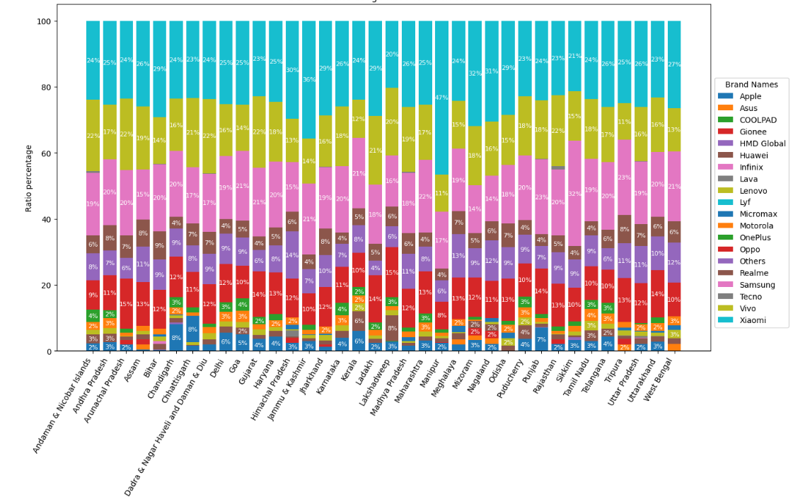
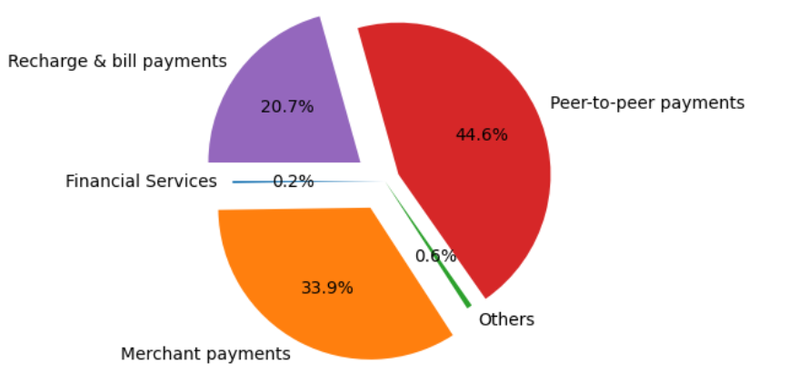
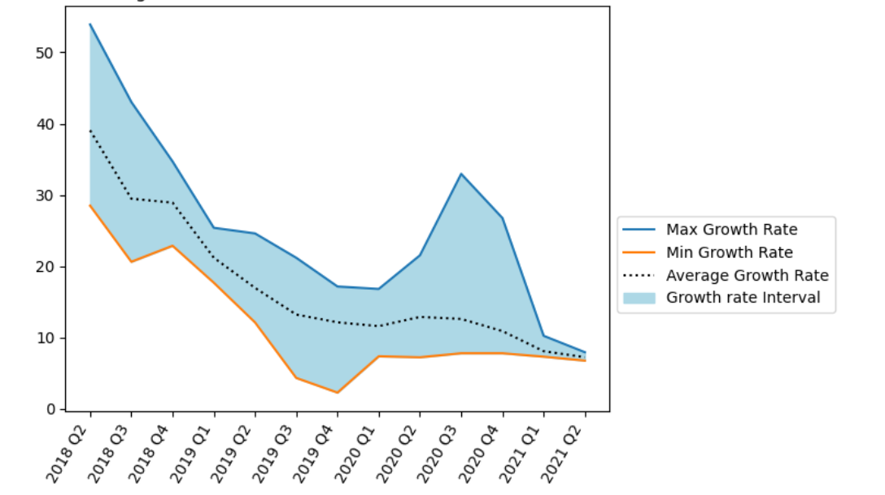

# PhonePe Pulse Data Analysis

A project focused on analyzing PhonePe Pulse data to gain insights into transaction patterns, user behavior, and the impact of the COVID-19 pandemic on digital payments. Actionable recommendations are provided to enhance user experience, service utilization, and transaction growth.

## Table of Contents
- [Project Overview](#project-overview)
- [Goals](#goals)
- [Technologies Used](#technologies-used)
- [Dataset](#dataset)
- [Analysis and Findings](#analysis-and-findings)
- [Conclusion](#conclusion)
- [Actionable Recommendations](#actionable-recommendations)
- [Future Work](#future-work)

## Project Overview

This project analyzes PhonePe Pulse data to understand user distribution, transaction volumes, and device usage across different states and districts of India. It also explores the effect of the COVID-19 pandemic on transaction patterns and provides recommendations to enhance service usage and customer retention.

## Goals

- **Analyze transaction patterns:** Understand how transaction volumes and user engagement vary across different states and districts.
- **Identify key trends:** Observe trends before, during, and after the COVID-19 pandemic.
- **Improve service utilization:** Provide recommendations to increase adoption of underutilized services like financial payments.

## Technologies Used

- **Python**: For data analysis and manipulation.
- **Pandas**: To work with structured data.
- **NumPy**: For numerical computations.

## Dataset

The dataset consists of multiple sheets capturing state-wise and district-wise PhonePe transaction and user data, including:
- **Transaction data**: Total number of transactions, transaction volume, and breakdown by sector (P2P, merchant payments, etc.).
- **User data**: Number of registered users by state, device types, and population demographics.

## Analysis and Findings

### Key Findings

1. **Strong correlation** observed between the number of transactions and the total amount.
2. In some states, the **ratio of registered users to the overall population exceeds 100%**.
3. Nearly **75% of registered users** belong to five brands: Xiaomi, Vivo, Samsung, Realme, and Oppo.

4. A **downward trend** in transactions, total amount, and app opens during the COVID-19 pandemic, except for registered user growth.
5. **Upward trend** after Q2 2020, driven by the shift towards digitalization.
6. **P2P and merchant payments** dominate transaction volumes, while financial services and others contribute the least.
   
7. The **recharge and bills sector** was the only sector unaffected by the pandemic.
8. The **average growth rate remained stable** after mid-2019, with minimal quarterly variations.
 
9. **High volatility** observed in the overall growth rate of transactions.
10. A **weak correlation** was observed between population density and transaction volume across states.

## Conclusion

The analysis revealed that digital payments have shown resilience during the pandemic, with strong growth in user registrations and recovery in transaction volumes post-pandemic. However, there are significant opportunities to increase engagement with financial services and lesser-used services.

## Actionable Recommendations

### 1. Enhance Financial Service Utilization

- **Raise awareness** of financial services like insurance payments, mutual funds, and loans through targeted digital campaigns.
- **Collaborate with financial institutions** to provide bundled services directly through the platform.

### 2. Boost Adoption of Lesser-Used Services

- **Run promotions** for underutilized services to increase awareness and adoption.
- **Expand the 'Others' category** to include day-to-day activities like public transport tickets and parking payments.

### 3. Improve Growth of Transactions and App Users

- **Enhance user experience**: Simplify the user journey and use AI to recommend personalized offers and discounts based on user behavior.
- **Introduce reward programs**: Offer loyalty points or cashback to frequent users.
- **Gamification**: Add features like challenges, leaderboards, and rewards to drive user engagement.

### 4. Target Existing Users

- **Promote additional features**: Encourage users to explore other services they haven't used.
- **Predictive analytics**: Anticipate when users are likely to stop using the platform and offer retention strategies like discounts or cashback.
- **Reactivate inactive users**: Launch campaigns to encourage re-engagement with inactive users.

### 5. Enhance P2P and Merchant Payments

Since P2P and merchant payments dominate transaction volumes:
- **Introduce convenient features** like instant refunds and credit options to retain users.

## Future Work

- **Predictive Modeling**: Implement machine learning models to forecast transaction growth and user behavior trends.
- **Real-Time Analytics Dashboard**: Develop a dashboard for real-time tracking of key metrics such as transaction volumes, user growth, and sector performance.
